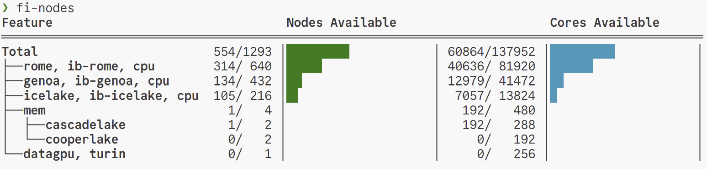

# fi-slurm-utils

This repo contains the source code for a set of Rust-based command-line utilities for interacting with the Slurm job scheduler. 

fi-slurm-utils was developed at Flatiron Institute by [Nicolas Posner](https://github.com/nrposner), with contributions from [Lehman Garrison](https://github.com/lgarrison), [Dylan Simon](https://github.com/dylex), and [Alex Chavkin](https://github.com/alexdotc).

## Example


## Overview

The primary utilities are:
- `fi-nodes`: a CLI and TUI for querying availability of nodes, CPUs, and GPUs.
- `fi-slurm-limits`: a CLI for displaying individual and group resource use relative to their assigned resource limits.

These utilities are built on top of a set of Rust interfaces to Slurm's C APIs:
- `fi-slurm`: a high-level Rust API (consisting of owning Rust types) to the `slurm.h` API.
- `fi-slurm-db`: likewise, but for the `slurmdb.h` API.

These APIs are built on a rust-bindgen package:
- `fi-slurm-sys`: a low-level, automatically-generated interface to the `slurm.h` and `slurmdb.h` APIs

The `fi-nodes` utility also has an optional interactive TUI (terminal user interface) that queries Prometheus:
- `fi-prometheus`: an API to query Prometheus for time-series data about the Slurm cluster
The TUI is under development, and its compilation can be enabled with the `"tui"` Cargo feature.

We hope to use this foundation to build more utilities, including:
- `fi-job-top`, a TUI interface for viewing node resource usage on currently-running jobs

## Building
The main build complexity of fi-slurm-utils is in the fi-slurm-sys package, because it runs rust bindgen. bindgen requires libclang and the Slurm development headers. If libclang is not found, you may need to set `LIBCLANG_PATH`. The Slurm development headers are usually installed as part of the `slurm-devel` package. The fi_surm_bind crate links against `libslurm`, so this library is required at runtime.

With these dependencies installed, the build procedure is simply:
```console
cargo build --release
```

To enable the `fi-nodes` TUI (brings in Prometheus dependencies):
```console
cargo build --release --features tui
```

## Configuration
`fi-slurm` currently has very limited site configuration through a `site.conf` file located in the same directory as the running binary. The contents of this file are used to populate the `cluster_list` field in the `slurmdb_assoc_cond_t` struct.

## License
Copyright 2025 The Simons Foundation, Inc.

SPDX-License-Identifier: Apache-2.0
